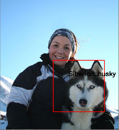
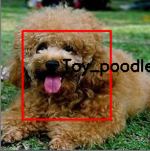
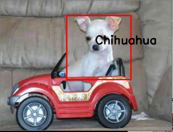

### Computer Vision Final Project
This is our coputer vision final project. It includes a classifier and a convolutional neural network model. 

### File Description 
|  File&Dir name   | Usage  |
|  ----  | ----  |
| dog_breed |                   Dataset of training samples
| dog_classifier.xml |          OpenCV classifier, recognizing dogs in an input image and captureing close-up photo of dog   
| dog_recognition.py |          Main function recognizing and classifying dogs. It is compiled in Windows environment. 
| dogbreed.h5 |     		        Convolutional neural network model  
| dognet_train.py |             Function training CNN model 
| load_dataset.py |             loading the training samples from local directories

### Performance

### Reference 
- https://github.com/Hironsan/BossSensor
